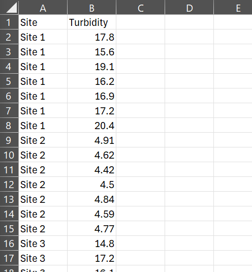

```{r setup, include=FALSE}
knitr::opts_chunk$set(echo = TRUE, warning = FALSE, message = FALSE)
```

# Data and Statistics in R - *Aquatic Ecosystems*

## Introduction

This is a tutorial for students who are either unable to use `Past` or are interested in improving their R skills.

The objectives are the same as those in the lab manual (*pp 44 - 51*) and we will use the same dataset (Turbidity data).

The objectives are:

1.  Load libraries and get the data into R
2.  Construct a visualisation of the data, i.e, a barchart with SE bars.
3.  Check the data for normality using a **Shapiro-Wilk Tes**t
4.  Perform an analysis of variance (**ANOVA**) on the data to test whether there is a significant difference between sites. Depending on the distribution of the data, this will either be a standard parametric **One-Way ANOVA** or a non-parametric **Kruskal-Wallis Test**.
5.  If the results of the ANOVA are significant, perform a post-hoc test to determine which sites are different from each other. This will be a **Tukey's HSD test** for parametric data and a **Dunn's test** with a **Bonferroni adjustment** for non-parametric data.
6.  The write-up - *Reporting of the data is covered in the Lab Manual*

Packages used in this script will be `tidyverse`, `here`, and `FSA`. If these packages are not installed, install them with: install.packages("package_name"), e.g., install.packages("tidyverse").

`tidyverse` is a collection of packages that work well together and are designed for data science including `ggplot2`, `readr`, and many more.

`here` is completely optional. It is a package that makes it easier to work with file paths. Instead of typing out the full path to a file, you can use the `here` function to find the file in the working directory.

`FSA` is a package that contains functions for fisheries science and aquatic ecology. It has heaps of functions including a nicely written `dunnTest` function which is what we will be using it for.

*Note: There are many ways to do the same thing in R. This is just one way to do it.*

# 1. Set up

The following code assumes you have the data file in the same directory as this script. If not, you will need to change the path to the file.

Before running the following code. The data has been saved as a `.csv` file and is called `aquaDataTurb.csv` (*See below*).

{width="300"}

If you are not used to using scripts, you can try creating a new project in the same place you've saved the csv file. This will automatically set the working directory to the location of the project.

To do this, select File \> New Project \> Existing Directory (*See Below*).

You can also check that you are currently in the correct working directory by using the `getwd()` function. If you are not in the correct directory, you can change it using the `setwd()` function.

{width="200"}

{width="200"}

## Loading libraries and data

```{r message=FALSE, warning=FALSE}
# Load required libraries
library(tidyverse)  # for data manipulation and plotting
library(here)       # for easier file paths (optional)
library(FSA)        # for Dunn's test and other ecology tools

# Set working directory using 'here' (ensure you're in an R project)
setwd(here())

# Load dataset
data <- read_csv(here("aquaDataTurb.csv"))

```

# 2. Visualisation

We will visualise the data using a barplot of the mean values per site with standard error bars.

You may be unfamiliar with some parts of the code below. Don't worry too much about that for now, just try to understand the general structure of the code.

We first take our dataframe (data) and pipe it (that's this thing `%>%`, *see Appendix* for more information) into ggplot with our aestheics being Site on the x-axis and Turbidity on the y-axis.

We then add a geom_bar layer to plot the mean values of Turbidity per site.

Next, we add a `geom_errorbar` layer to plot the standard error bars.

Finally, we add some theme elements to make the plot look nice and customise the axis label so as to include the units.

To do this with other variables, you would simply change the x and y aesthetics in the `ggplot` function and the label functions.

```{r}
turb_plot <- data %>%
  ggplot(aes(x = Site, y = Turbidity)) +
  geom_bar(stat = "summary", fun = "mean", fill = "skyblue") +
  geom_errorbar(stat = "summary", fun.data = "mean_se", width = 0.2) +
  theme_classic() +
  theme(axis.text.x = element_text(angle = 45, hjust = 1)) +
  labs(x = NULL, y = "Turbidity (NTU)")

print(turb_plot)
```

## Save the plot

Save the plot as a png if you like it.

Use the `ggsave` function to save the plot as a png file.

*Note: It will automatically use the last plot you created, and save it to the working directory unless otherwise specified.*

You can change the size and resolution of the plot by adding arguments to the ggsave function.

Check out the help file for more information. i.e., `?ggsave`

```{r}
ggsave("Turbidity_plot.png")
```

# 3. Analysis

An ANOVA is a parametric test that assumes the data being analysed is normally distributed. That is, the total error above and below the population mean should add up to zero and the likelihood of sampling a value becomes less likely the further from the mean it is.

Normality can be determined visually, but we will test it statistically using a **Shapiro-Wilkes** test.

A significant result means the data is **not normally distributed** and we will thus use a non-parametric test instead which does not assume normally distributed data.

*Note: We want to know if the data within each site is normally distributed, not the data as a whole.*

In the code below, we use pipes again which make the code more readable (*See Appendix*).

We `group` the data by Site and then use the `summarise` function to calculate the p-value of the Shapiro-Wilkes test for each site.

The `summarise` function applies a function to each level of what ever you grouped the data by. In this case, it applies the `shapiro.test` function to the Turbidity data for each site.

```{r}
normality_results <- data %>%
  group_by(Site) %>%
  summarise(p_value = shapiro.test(Turbidity)$p.value)

print(normality_results)
```

*Interperetation: If the p-value is less than 0.05, we reject the null hypothesis that the data is normally distributed.*

## ANOVA

### Normal data - One-Way ANOVA

If the data is normally distributed, we can use a **One-Way ANOVA** to test for differences between sites.

In R, a model is written with a `~` symbol where the variable on the left is the response variable and those on the right of the `~` are the independent variable(s).

Our research question is: "Is there a significant difference in Turbidity between sites?" Thus,

*Turbidity \~ Site*

The model is then passed to the `aov` function along with the data.

To see the results, we pass the model to the `summary` function.

```{r}
anova_turb <- aov(Turbidity ~ Site, data = data)

summary(anova_turb)
```

### Significant result - Post-hoc test

If the ANOVA is significant, we can perform a **post-hoc test** to determine which sites are different from each other.

In this case, we will use **Tukey's HSD** test.

```{r}
TukeyHSD(anova_turb)
```

### Non-normally distributed data - Kruskal-Wallis Test

If the data is not normally distributed, we can use a **Kruskal-Wallis** test to test for differences between sites.

The code is very similar to the **ANOVA**, but we use the `kruskal.test` function instead of the `aov` function.

We do not need to pass the results into the `summary` function as the output is already in a readable format.

```{r}
kruskal.test(Turbidity ~ Site, data = data)
```

### Post-hoc test - Dunn Test

If the **Kruskal-Wallis** test was significant, we can perform a post-hoc test to determine which sites are different from each other.

The **Dunn test** is a non-parametric equivalent to Tukey's HSD test.

Because the data was not normally distributed, we use a **Bonferroni adjustment** to account for the pitfalls of multiple comparisons. i.e., we want to avoid making a **Type I error**.

The syntax is similar to the previous models.

*Remember to refer to the adjusted p-values when interpreting the results.*

```{r}
dunnTest(Turbidity ~ Site, data = data, method = "bonferroni")
```

# Appendix

## What is Piping (`%>%`)

*"Piping"* is used preferentially as an aesthetic choice. It enhances readability.

### How it works

It uses the pipe operator (`%>%`) which takes whatever is fed into it (e.g., `Data`) and passes it into the next function as the first argument.

That is,

`x %>% function(df)`

is the same as:

`function(x, df)`

In other words:

`"I will take an apple, slice it, then eat it"`

is the same as:

`"I will eat a sliced apple"`

Or, if translating to R:

`Apple %>% Slice() %>% Eat()`

is the same as:

`Eat(Slice(Apple))`

The first "sentences" in the above examples may seem more verbose, but if aiming to have your code understandable rather than purely functional, then piping is preferred.

This is especially the case when the functions take multiple arguments. Suppose we want to specify what we will slice the apple with ("knife"): `Slice(Apple, with = "knife")`

Then, the piping version is:

e.g., `Apple %>% Slice(with = "knife") %>% Eat()`

which is more readable from left to right than:

`Eat(Slice(Apple, with = "knife"))`
